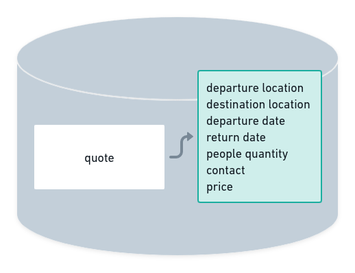
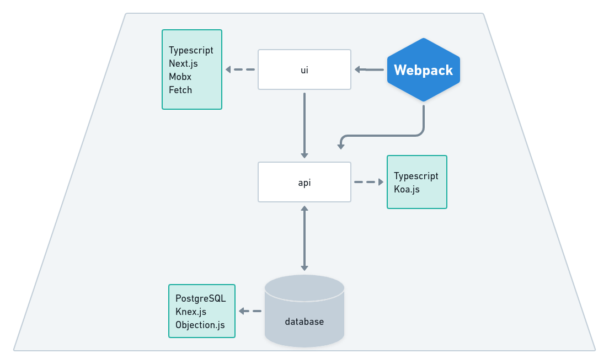

# launch-code-challenge-wet-bat

### More docs

<a href="./api/README.md">api</a> | <a href="./ui/README.md">ui</a>

## Views

### Home

## Quotes details

## Setup and running

To run this fullstack app locally, you'll need:
 - `Yarn` >= v1.22.5
 - lastest versions of `docker` and `docker compose`
- `node` >= v16, in order to run the services individually.

Before all, you'll need make copies of the `.env.default` files in all subdirs (`api`, `db`, `ui`), fill in and renaming them to `env.production`. After that, go to `root dir` and run sequentially:

1. build:

Run the command below and await the build proccess (must take few minutes)
   - `yarn build`

2. start:

Run one of the command below and await the start proccess (must be very fast). The app should run on the `port 3000` or the one defined in `.env` files.
   - `yarn start` or `yarn start-silent`

3. stop:

Run the command below to stop the app and down the containers (must be very fast)
   - `yarn stop`

## Current features

- [x] Create quick quote
- [x] Pending quotes visualization
- [x] Quick quote form custom styles
- [x] Pending quote visualization
- [x] Docs updates (v1)

## Foundations

### Business

Wet Bat is a web app that aims users who works in travel companies which wants get and manage quick quotes.

### Database

This section give us a visual percepetion of main database entity and their properties.

    

### Assets

This app operations is distributed through these assets below.

    

### Architecture

All the assets, excepts database, are based in Clean Architecture, following the Dependency Rule: <i>"source code dependencies can only point inwards"<i>.

    

### More docs

<a href="./api/README.md">api</a> | <a href="./ui/README.md">ui</a>

